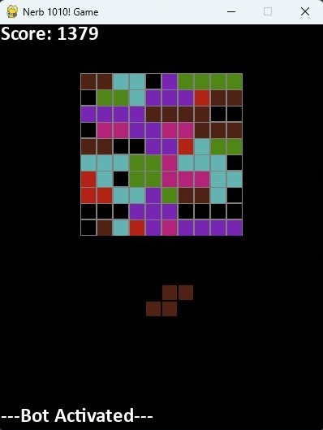

# Bot_1010
Nama    : Nigel Sahl

NIM     : 13521043


## Table of Contents
* [General Info](#general-information)
* [Technologies Used](#technologies-used)
* [Features](#features)
* [Screenshots](#screenshots)
* [How to Run](#how-to-run)
* [Project Status](#project-status)
* [Room for Improvement](#room-for-improvement)


## General Information
1010! game is a puzzle game where you have to fill a 10x10 board with tetris-like pieces. The game ends when you can no longer place any piece on the board. The goal of this project is to create a bot that can play the game automatically. The bot will be using an greedy algorithm to determine the best move to make. The bot will be using a GUI to display the game and the bot's moves.

## Technologies Used
- Python - version 3.11.3
- pygame
- numpy


## Features
List the ready features here:
- The bot can play the game automatically using a greedy algorithm.
- The game can be played manually by the user.
- The game has several souds to make the game more enjoyable. 

## Screenshots



## How to Run
1. Open terminal and go to the src folder of the project where the main.py file is located.
2. Run the main.py file using the command 
    ```bash
    python main.py
    ```
3. The game will start and the default mode is manual mode. 
4. The keys to control the game are:
    - Arrow keys or WASD to move the piece. Those keys will move the piece one block at a time. To move the piece faster and continuously, hold the 'ctrl' + arrow keys or 'ctrl' + WASD.
    - Click the piece with left mouse button to choose the piece. (The default chosen piece from left to right, after the left piece is placed, next is the middle piece, and then the right piece.)
    - click 'c' to change the rotation of the piece.
    - click space bar to place the piece.
    - click 'esc' to restart the game or if the game is over, click 'esc' to start a new game.
    - click **'ctrl' + 'b'** to change the mode to **bot mode**. (it can be changed back to manual mode by clicking 'ctrl' + 'b' again, the bot mode can be activated anytime during the game not just at the start of the game.)

## Project Status
Project is: _complete_ 


## Room for Improvement

Room for improvement:
- speed up the algorithm: Optimize the algorithm to make it run faster.
- Improve user interface and user experience: Enhance the GUI to make it more visually appealing and user-friendly.


